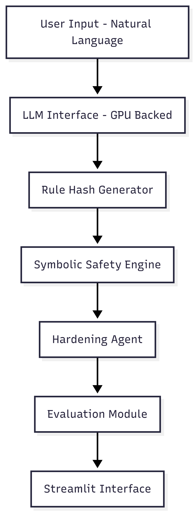

# SafeLogic-AI

SafeLogic-AI is a hybrid validation engine for PLC-based safety logic.
It combines language model reasoning with deterministic rule enforcement.

The system is designed to explore how generative AI can assist in safety validation while maintaining strict rule-based control.

---

## Project Objective

Industrial PLC systems require reliable and deterministic safety checks.

Language models can understand intent and interpret logic, but they are probabilistic and cannot guarantee rule compliance.

SafeLogic-AI addresses this gap by combining:

- Language-based reasoning
- Symbolic rule validation
- Structured safety enforcement
- Explainable output

---

## System Architecture

Core modules:

- llm_interface.py
- safelogic_engine.py
- hardening_agent.py
- evaluation_runner.py
- streamlit_app.py

---

## How It Works

1. User provides PLC-style logic or instruction.
2. The language model interprets the intent.
3. The symbolic engine validates logic against predefined safety rules.
4. Rule hashing ensures rule integrity.
5. The hardening layer detects unsafe patterns.
6. The system returns validation results with explanation.

---

## Key Features

- Hybrid LLM and symbolic validation
- Deterministic rule enforcement
- Structured evaluation pipeline
- Configurable safety rules
- Interactive interface using Streamlit
- Modular and extendable architecture

---

## Technology Stack

- Python
- Streamlit
- Rule-based validation logic
- Hash-based integrity verification
- GPU-backed inference environment (DigitalOcean vLLM droplet)

---

## Running the Application

Inside the Docker container:

streamlit run src/streamlit_app.py --server.address 0.0.0.0 --server.port 8502

Open in browser:

http://<server-ip>:8502

---

## Potential Applications

- PLC safety validation
- AI-assisted logic review
- Rule compliance checking
- Industrial safety auditing

---

## Author

Nivendra Yuvaraj
AMD AI Engage Participant
